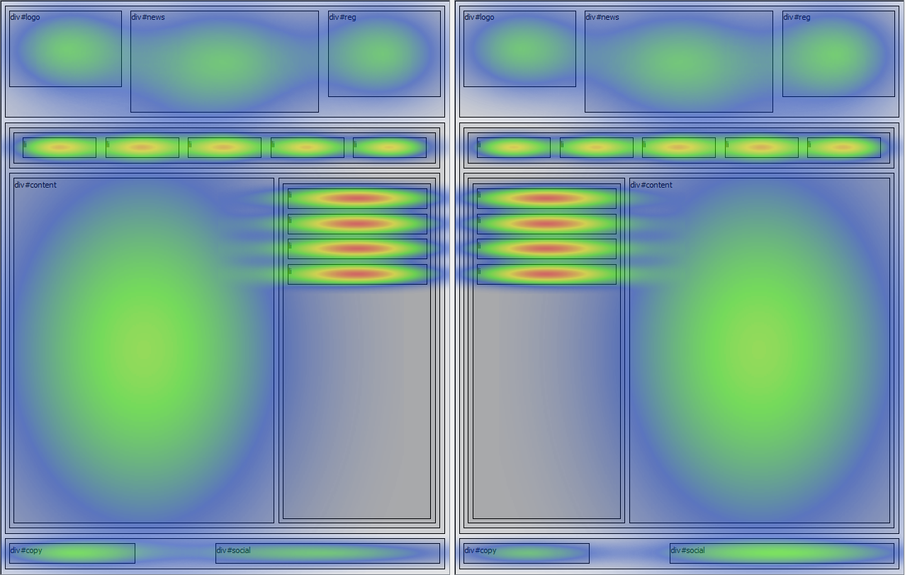

# Interface Heatmap Optimization
Оптимизация веб-интерфейса при помощи популяционных алгоритмов с использованием тепловых карт взаимного расположения 
элементов интерфейса.

## Описание

Данное ПО служит для оптимизации интерфейса, описанного древовидной структурой на языке JSON. 

Пользовательский интерфейс реализован при помощи библиотеки Qt. 

Программное очеспечение позволяет оптимизировать интерфейс на основе другого интерфейса (выбранного в качестве эталона).
При этом оптимизируемому интерфейсу будут присваиваться характерные особенности эталонного.

На данный момент реализовано 3 популяционных алгоритма опимизации:
+ Генетический алгоритм (ГА)
+ Алгоритм пчелиной колонии
+ Алгоритм поиска системой зарядов

ГА и алгоритм пчелиной колонии производят оптимизацию на основе тепловых карт взаимного расположения элементов интерфейса,
алгоритм поиска системой зарядов - на основе энергии взаимодействия системы точечных зарядов.

## Как использовать?

Программа работает с файлами интерфейсов, описанные на языке JSON (в корневой директории есть несколько примеров).

1. Для оптимизации интерфейса следует загрузить 2 JSON файла: первый будет содержать описание эталонного интерфейса, 
второй - описание тестируемого интерфейса.

2. Выбрать один из трёх алгоритмов оптимизации

3. Начать оптимизацию, нажав "start". При это на каждой итерации будет меняться внешний вид оптимизируемого интерфейса 
(отображается лучший вариант текущей итерации).

### Лицензия

Лицензия MIT.
